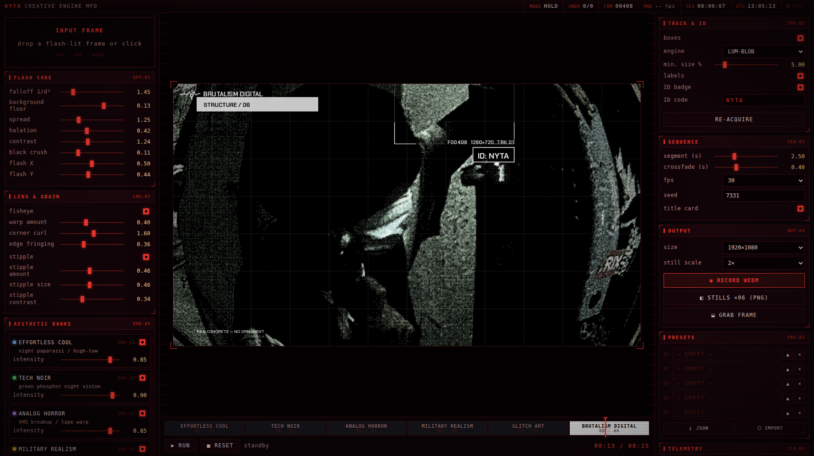

# NYTA CREATIVE ENGINE

A single-file, offline image and video aesthetic engine. You feed it one flash-lit
photograph; it walks that frame through six visual movements and gives you back a
video plus one high-resolution still per movement.

No server, no build step, no install. One `.html` file that runs in Chrome.



---

## What it actually does

This is not a generative model. Nothing is invented. The engine takes **your own
photograph** and transforms it, so everything it produces is original work derived
from an image you own.

The pipeline is deterministic: the same input, the same seed and the same settings
always produce the same frame, down to the pixel. That matters because it lets the
tool render a preview frame and an export frame from the same code path at different
resolutions, and it means a look you find once is a look you can reproduce.

### Flash core

The signature of on-camera flash is the inverse-square falloff: light drops off with
the square of distance, so whatever is near the lens blows out and everything behind
it collapses into black. A photograph carries no depth data, so the engine estimates
it — luminance combined with radial distance from the flash origin gives a usable
proxy for *near*. Bright means close. That estimate drives the falloff, the halation
bloom on the near subject, and the crush on everything behind it.

### Lens and grain

**Fisheye.** A conventional fisheye is a single function of radius: it bends every
direction equally. This one adds a term that peaks on the diagonals and vanishes on
the axes, `sin²(2θ)`, so the four corners curl toward the centre while the edge
midpoints stay comparatively straight. Warp strength is tied directly to centre
magnification, which means increasing the corner curl changes the *character* of the
bend without cropping the frame. Per-channel sampling offsets reproduce the colour
fringing real wide-angle glass shows at the edges.

**Stipple.** The speckled, photocopied texture is not a grain overlay. Noise is added
to luminance **before** the contrast curve, not after. Because of that ordering the
speckle concentrates in the midtones and clears out of the blacks and highlights,
which is what separates a stipple from television static. Three octaves of noise
give it clumping.

### The six movements

| Bank | Movement | Treatment |
|:--|:--|:--|
| 01 | **Effortless Cool** | Split-tone, bloom, fine grain, gate weave — the night-paparazzi look |
| 02 | **Tech Noir** | Green phosphor LUT, scanlines, horizontal sync displacement |
| 03 | **Analog Horror** | Tape warp, tracking bar, dropout bars, heavy grain |
| 04 | **Military Realism** | Ironbow FLIR ramp, targeting reticle, telemetry HUD, sweep line |
| 05 | **Glitch Art** | Slice displacement, block corruption, RGB channel separation |
| 06 | **Brutalism Digital** | Bayer ordered dither to 1-bit, hard modular grid, concrete typography |

Each bank caches its static per-pixel work and only recomputes the moving parts per
frame, which is what keeps playback interactive.

### Tracking

Objects are detected once per input with TensorFlow.js COCO-SSD, or with a built-in
luminance-blob detector when no model is available — a fallback that suits the
aesthetic, since under flash *bright* already means *near* means *subject*. Detected
regions get HUD corner brackets and an ID badge anchored to the primary box. Box
geometry is mapped through both the frame fit and the fisheye warp, so brackets stay
locked to their subject rather than floating over it.

---

## Running it

Open `nyta_creative_engine.html` in Chrome. That is the whole installation.

For a windowed app without tabs or an address bar, run `install_shortcut.ps1` once:

```powershell
powershell -ExecutionPolicy Bypass -File install_shortcut.ps1
```

It creates a desktop shortcut that launches Chrome in application mode against its own
profile, and points that profile's downloads at an `OUTPUT` folder next to the tool, so
exports land beside the project instead of in Downloads. `NYTA.bat` does the same thing
and resolves its own location, so it keeps working if you move the folder.

The interface font is embedded in the file as base64, so the tool renders identically
with no network connection. Only COCO-SSD needs the internet; without it the engine
falls back to blob detection and says so.

### Working with it

Drop a flash-lit frame into the left panel. Tune the flash core until the background
sits where you want it — *background floor* is the control that decides how much of
the scene behind the subject survives. Toggle banks on and off; a disabled bank drops
out of the sequence and the video shortens. Click a segment on the timeline to jump to
the middle of that movement, which is the fastest way to judge a look.

`RECORD WEBM` captures the sequence. `STILLS` renders each movement's midpoint at up to
3× the output size. `GRAB FRAME` saves whatever is on screen. Playback speed (1× to 16×)
applies to both preview and recording.

Ctrl+Z and Ctrl+Y walk the undo stack — one entry per slider gesture, not per pixel of
travel. Five preset slots hold a complete configuration each and survive restarts;
export them to JSON for a backup that outlives the browser profile.

---

## Built with

Vanilla JavaScript and the Canvas 2D API. TensorFlow.js and COCO-SSD for detection.
Chakra Petch for typography. No framework, no bundler, no dependencies to install.

## License

MIT — see [LICENSE](LICENSE).
